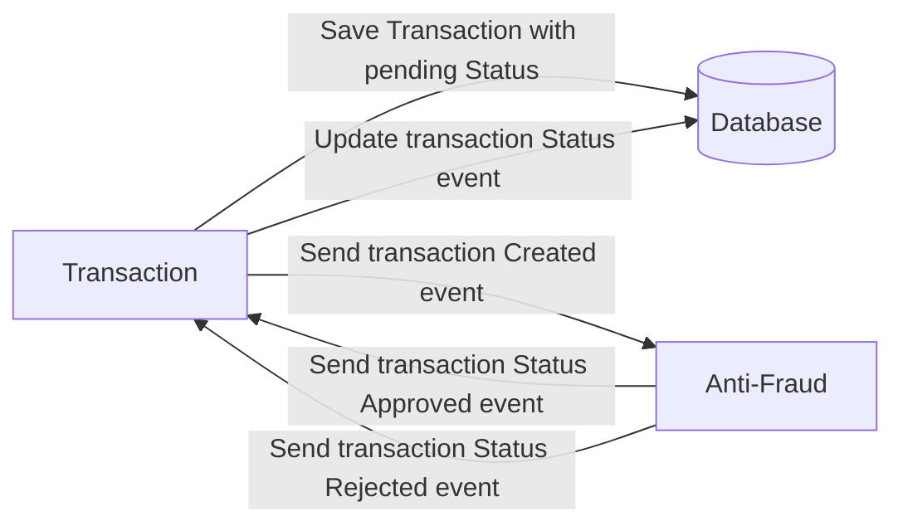
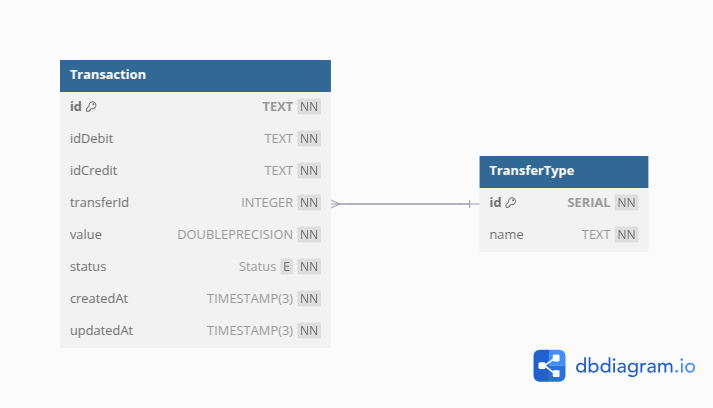

# Yape Code Challenge :rocket:

Our code challenge will let you marvel us with your Jedi coding skills :smile:.

Don't forget that the proper way to submit your work is to fork the repo and create a PR :wink: ... have fun !!

- [Problem](#problem)
- [Tech Stack](#tech_stack)
- [Send us your challenge](#send_us_your_challenge)

# Problem

Every time a financial transaction is created it must be validated by our anti-fraud microservice and then the same service sends a message back to update the transaction status.
For now, we have only three transaction statuses:

<ol>
  <li>pending</li>
  <li>approved</li>
  <li>rejected</li>  
</ol>

Every transaction with a value greater than 1000 should be rejected.



# Solution

### Set up environment variables

Create a `.env` file in the root directory and add any required environment variables (e.g., API keys, database URLs). Check `.env.example` for a template.

```env
POSTGRES_HOST='your_host'
POSTGRES_USER='database_username'
POSTGRES_PASSWORD='database_password'
POSTGRES_PORT=database_external_port
POSTGRES_DB='database_name'
POSTGRES_SSL=database_ssl_status
DATABASE_URL='database_url'
PORT=transaction_service_api_external_port
```

## Database

### Database structure



### Seeds

Eight different transfer types were previously seeded into the database.

```javascript
[
  { 1: "ATM" },
  { 2: "Charge" },
  { 3: "Check" },
  { 4: "Deposit" },
  { 5: "Online" },
  { 6: "POS" },
  { 7: "Transfer" },
  { 8: "Withdrawal" },
];
```

## Starting application

### Running docker compose script

```bash
docker compose -f 'docker-compose.yml' up -d --build
```

## Services

- Antifraud: Intended to check all transactions
- Transaction: The API server is responsible for creating new transactions and manipulate.
- Database: Intended to persiste all data
- Kafka broker: Working with boths(Transaction and Antifraud) services listening events
- Zookeeper: Responsible for overseeing and managing Kafka brokers.

## API

The api will be running on [http://localhost:{4000}/graphql](http://localhost:4000/graphql).
_In this example, port 4000 is used, it can be any port of your choice._

### Using Graphql client

#### Creating new transactions

Allows create new transactions

- **Graphql query**:

  ```graphql
  mutation {
    createTransaction(
      input: {
        accountExternalIdDebit: "Guid"
        accountExternalIdCredit: "Guid"
        tranferTypeId: 5
        value: 500.87
      }
    ) {
      transactionExternalId
      transactionType {
        name
      }
      transactionStatus {
        name
      }
      value
      createdAt
    }
  }
  ```

- **Response**:

  ```graphql
  {
    data: {
        createTransaction: {
            transactionExternalId: "01951fd9-b7f0-71d0-9402-985e5ddf972d",
            transactionType: {
                name: "Deposit"
            },
            transactionStatus: {
                name: "pending"
            },
            value: 500.87,
            createdAt: "1739996116976"
        }
    }
  }
  ```

#### Listing transactions

Allows list all transactions created
. _All field are optionals(id,idDebit,idCredit,transferId,status,value,createdAt)_

- **Graphql query**:

  ```graphql
  query {
    getTransactions {
      id
      idDebit
      idCredit
      transferId
      status
      value
      createdAt
    }
  }
  ```

- **Response**:

  ```graphql
  {
    data: {
        getTransactions: [
            {
                id: "019515de-b304-76a0-a15d-954286f5eeaf",
                idDebit: "01951fea-3522-7625-991a-830cff56177a",
                idCredit: "01951fea-7b78-742c-9007-8710135ce31b",
                transferId: 8,
                status: "REJECTED",
                value: 1205.48,
                createdAt: "1739828671236"
            },
            {
                id: "01951fd9-b7f0-71d0-9402-985e5ddf972d",
                idDebit: "01951fea-ac02-702d-bc82-068d5a6c8b04",
                idCredit: "01951fea-f4b3-7d79-bf1a-282931aea271",
                transferId: 3,
                status: "ACCEPTED",
                value: 482.91,
                createdAt: "1739996116976"
            },
            {
                id: "01951feb-2f41-7e37-8db6-2dd8286be601",
                idDebit: "01951feb-2f41-7323-861a-ca44d3309ff9",
                idCredit: "01951feb-beda-7ae0-a513-2447e7b8fe5a",
                transferId: 6,
                status: "REJECTED",
                value: 1000.87,
                createdAt: "1739996356039"
            }
        ]
    }
  }
  ```

#### Getting a especific transactions using Id

Allows search transactions by Id
. _All field are optionals(id,idDebit,idCredit,transferId,status,value,createdAt)_

- **Graphql query**:

  ```graphql
  query {
    getTransaction(id: "019515de-b304-76a0-a15d-954286f5eeaf") {
      id
      idCredit
      status
      value
    }
  }
  ```

- **Response**:

  ```graphql
    {
    data: {
        getTransactions: {
          id: "019515de-b304-76a0-a15d-954286f5eeaf",
                idDebit: "3dfbe8b2-564f-4275-8d76-f47c9db3cf53",
                idCredit: "3da480a2-4319-4cc5-81f3-f05c378b78a3",
                transferId: 5,
                status: "ACCEPTED",
                value: 999.99,
                createdAt: "1740000991"
        }
    }
    }
  ```
